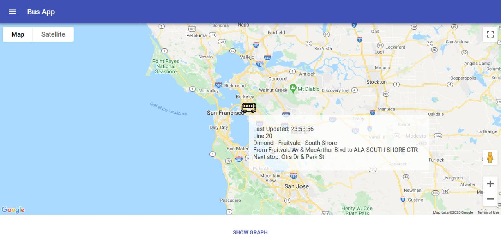
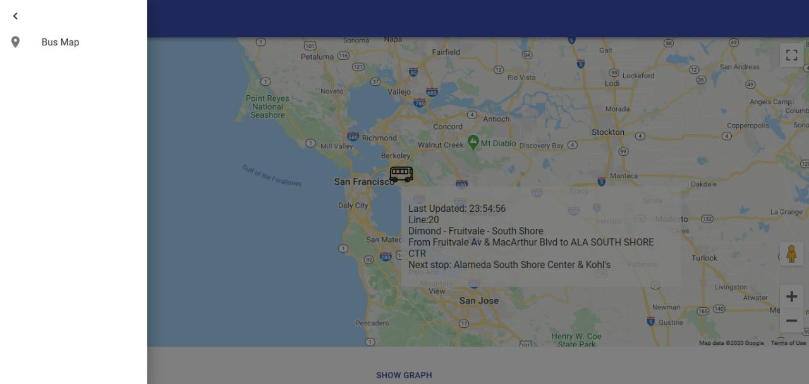
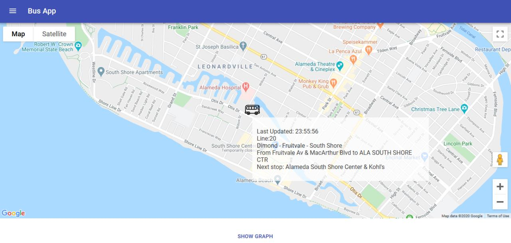
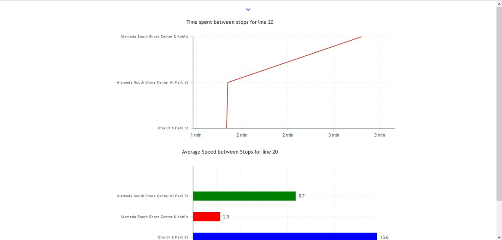
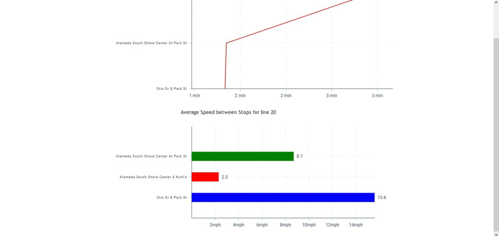

This app needs to be run with proper API keys from Google Maps and 511.org.  
Please plug in your own API keys after downloading.
### To start the app, run `npm start`.

Main page

Collapsible left menu with a tab

Updated bus location

Bottom Panel opens/collapses on click, includes two graphs. Top graph: Time spent between each stop. 

Bottom graph: Average speed between each stop, Stops with similar speeds are grouped and colored the same.
(The graphs will only show after enough data is collected for the tracked bus.)

